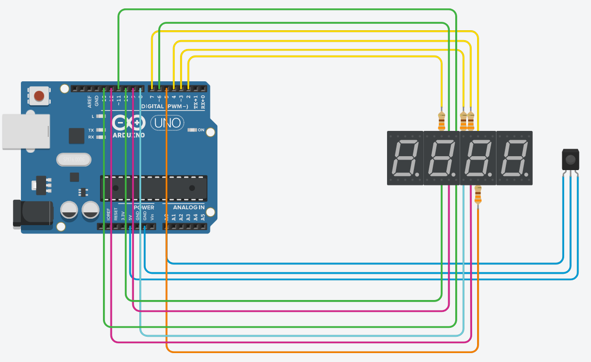

```cpp
;;;; ;;;;      ;;;; // PC Remote Control
;  ; ;         ;
;;;; ;    ;;;; ;
;    ;    ;    ;
;    ;;;; ;    ;;;; // by malisipi
```

> Did you need a remote control device for your PC?

We have a lot situation that require a remote control device in daily/work life.

* To make a presentation
* To see the time
* To adjust the volume of computer
* To control playing media
* To shutdown or lock the computer
* ...

There're a lot of reason to need it.

## Abilities

* Customizable
* Support for a lot of controller
* Cross-platform (Windows support is not finished yet!)
* 4-Digit display
* Free and Open-Source

## Wiring Diagram



## FAQ

<details>
<summary>My controller is not working</summary>

* It's okey. You need to change button definations in `arduino_driver/arduino_driver.ino`.

</details>

<details>
<summary>Sound control is not working</summary>

* Only pipewire supported at linux. If you're using pipewire already, install `pactl`. In future, keyboard simulation fallback will be added.

</details>

<details>
<summary>Media controls is not working</summary>

* You need to install `playerctl`. In future, keyboard simulation fallback will be added.

</details>

<details>
<summary>I want to add X command</summary>

* Just add some code to `python_driver/user_defined_commands.py` to support X command. Also you can use `python_driver/pre_defined_commands.py`.

</details>

<details>
<summary>Which board/OS is supported atm?</summary>

> Board
* It was tested on Arduino UNO rev3. However, it should work all Arduinos. If you was tested it on different Arduino, please report the support status.

> OS
* It was tested on Arch Linux/Wayland/Pipewire. It should work every Linux distro that have Pipewire, `playerctl`, `pactl`.

</details>

## License

> This project is licensed by Mozilla Public License 2.0.
